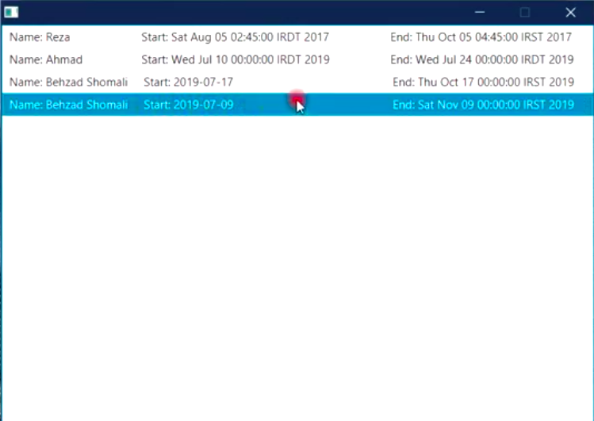
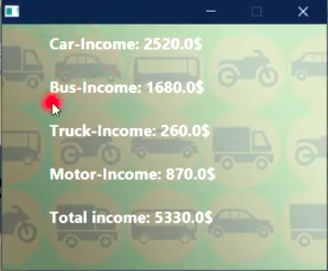

# Car Rental Management System (CRMS)

### Description:
The aim of this project is to design a Car Rental Management System (CRMS) using Java programming language, and JavaFX library for the Graphical User Interface (GUI). The system enables users to perform several actions, such as adding/removing car rental stores, garages, employees, and vehicles in four categories: car, bus, truck, and motorcycle.

For each new vehicle, the system generates a unique identifier which will be used later in invoices to specify which vehicle is going to be rented. We also record following information for a vehicle: : model, manufacturer, manufacture-year and a base-price.

There exists five different types of rental: 1. Hourly 2. Daily 3. Weekly 4. Monthly 5. Yearly. To encourage users to rent for a longer period, we apply 10% and 20% discount for monthly and yearly types, respectively. We also offer 15% discount for motorcycles in winter.

The system employs JSON data format for I/O operations. All data will be loaded and ready-to-use when the system is executed. By clicking on the “save” button, the user makes sure that all his/her changes will be written and stored for further usage.

### Sample images:
Following images illustrates some menus of the program. You can also find a demo video of how the program works, [here](https://drive.google.com/file/d/1npdfrvZaMg3U-4HSzx35uhGNTi1-crKI/view?usp=sharing "here")!

| Main menu_1  | Main menu_2 |
| ------------- | ------------- |
|   |   |

| In-rent list  | Rent menu |
| ------------- | ------------- |
|   |   |

| Vehicles list  | Stores list |
| ------------- | ------------- |
|   |   |

| Categorical total income  | Categorical vehicles list |
| ------------- | ------------- |
|   |   |

| Add car  | Exit message |
| ------------- | ------------- |
|   |   |
